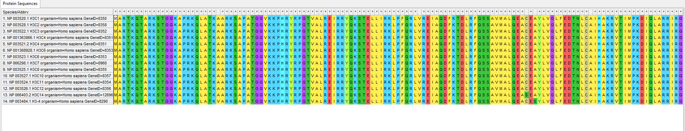

# hse23_project

## Описание белка
DnaJ Heat Shock Protein Family (Hsp40) Member C2 (DNAJC2) является эпигенетическим фактором, который вовлечен в ряд цитологических функций, таких как регуляция транскрипции и убиквитинирование. Ряд исследований показывает, что DNAJC2 тесно связан с некоторыми опухолями. DNAJC2 является опухоль-регулируемым белком в прогрессии CRC и может представлять собой новую мишень для обнаружения и терапии CRC. [ссылка](https://pubmed.ncbi.nlm.nih.gov/34165158/)

Ткани: Тестикулы(32.64), ВЭБ-трансформированные лимфоциты(25.58), Яичники(19.37), Шейка матки - эндоцервикс(18.08), Уретра(17.38)

Выполняет функцию Histone modification read

Связь с гистоновой меткой H2A показывается в данных статьях: [статья 1](https://pubmed.ncbi.nlm.nih.gov/28402505/), [статья 2](https://pubmed.ncbi.nlm.nih.gov/27599465/)

## Экспрессия и доменная структура

## Выравнивание гистонов

### H2A

### H2B

### H3

### H4

В H3 и H4 обладают почти что одинаковыми последовательнастями, следовательно они кодируют один и тот же ген. Аналогично для H2A и H2B, однако есть несколько отличающихся последовательностей, вероятно они кодируют ген, который выполняет схожие функции, но имеет иное строение.

## E-value
Некоторые протеомы отсутствуют, потому что в них не было хитов.

### -log:

### Heatmap

## Вывод
Белок не проявил себя в археях, бактериях и эукариотах, а следовательно, этот белок впервые появился у инфузорий в районе 600 млн лет назад.